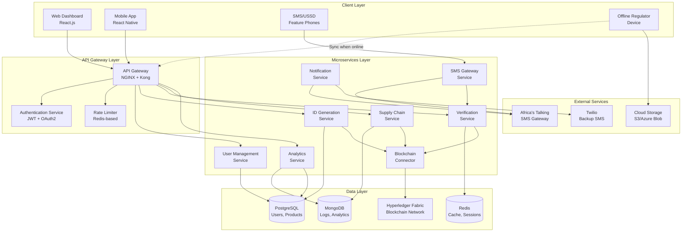
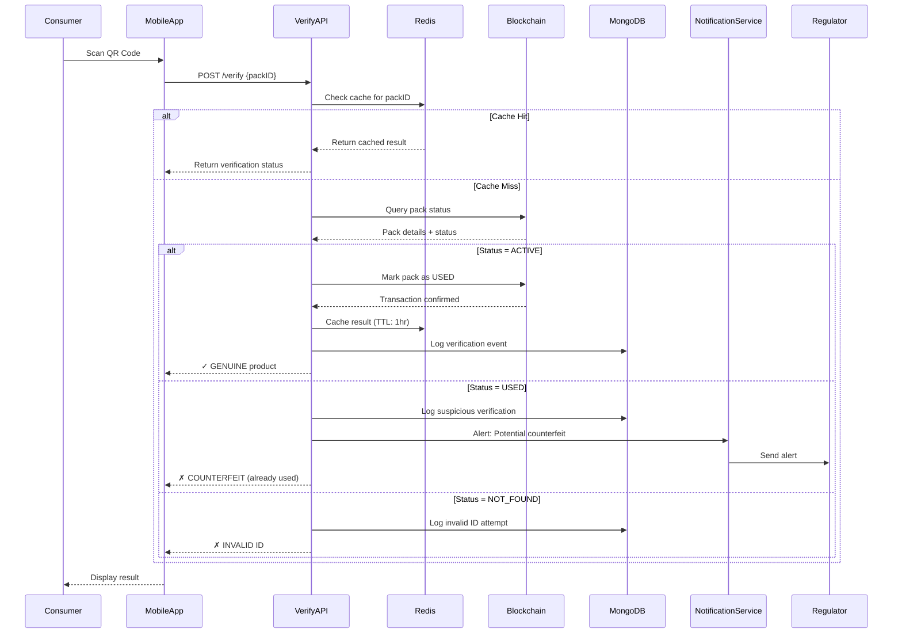
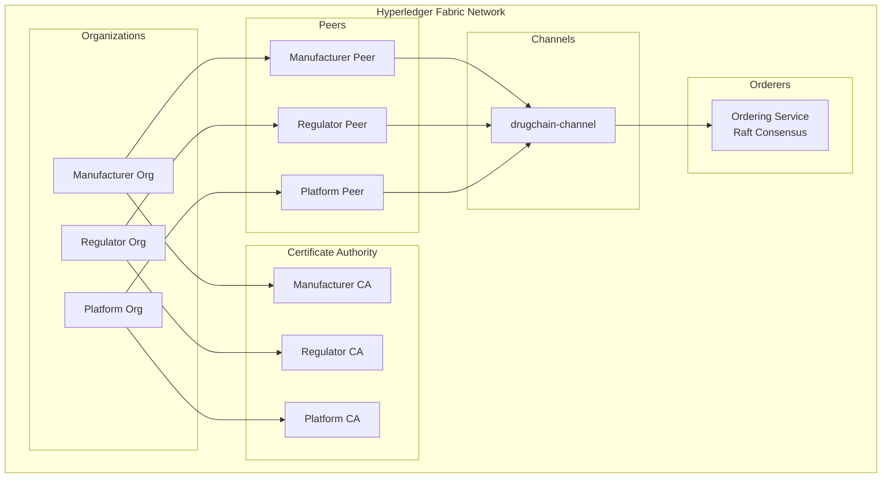
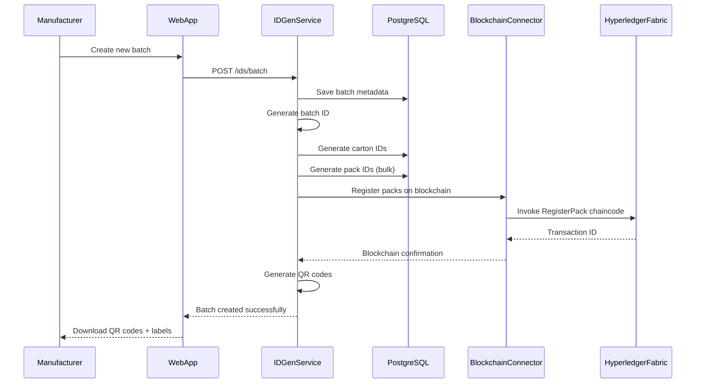
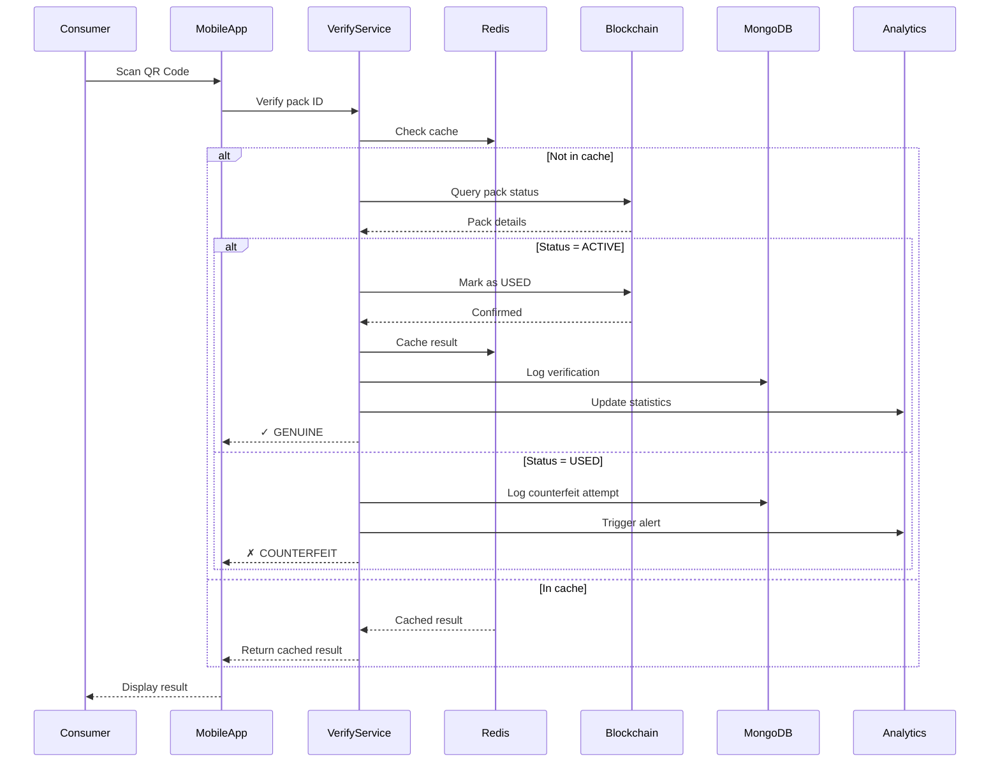
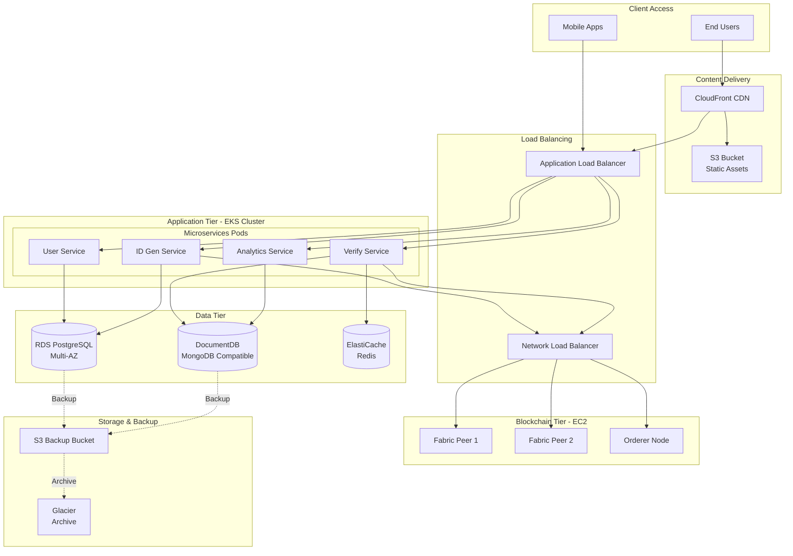
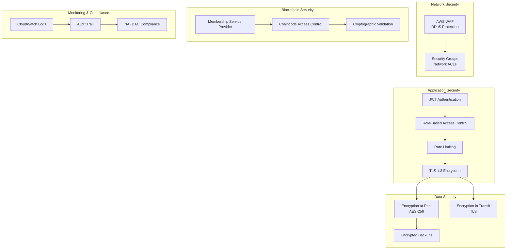

# DrugChain System Architecture Documentation

## 1. Executive Overview

DrugChain is a **hybrid blockchain-cloud platform** designed to combat counterfeit medicines in emerging markets through a three-level unique identification system, real-time verification, and immutable supply chain tracking.

### Key Architectural Principles
- **Hybrid Data Model**: Critical provenance data on blockchain, operational data in cloud databases
- **Offline-First Design**: Support for low-connectivity environments with synchronization
- **Microservices Architecture**: Independently scalable, maintainable services
- **Multi-Tenancy**: Support for multiple manufacturers, distributors, and regulatory bodies
- **Security by Design**: End-to-end encryption, RBAC, cryptographic ID generation

---

## 2. High-Level System Architecture



---

## 3. Component Architecture Details

### 3.1 Client Layer

#### Web Dashboard (React.js + Tailwind CSS)
**Purpose**: Multi-role dashboards for registered stakeholders

**Key Modules**:
- **Manufacturer Portal**
  - Product catalog management
  - Batch/Carton/Pack ID generation interface
  - Real-time distribution analytics
  - Verification statistics dashboard
  - Counterfeit alert monitoring

- **Regulator Portal**
  - Inspection report viewer
  - Evidence repository (photos, documents)
  - Alert management system
  - Nationwide analytics dashboard
  - Enforcement action tracking

- **Distributor/Pharmacy Portal**
  - Inventory management
  - Transfer logging interface
  - Product verification tool
  - Supply chain visibility

**Technology Stack**:
```json
{
  "framework": "React 18.x",
  "styling": "Tailwind CSS 3.x",
  "state_management": "Redux Toolkit",
  "routing": "React Router 6",
  "charts": "Chart.js + Recharts",
  "maps": "Leaflet.js (OpenStreetMap)",
  "http_client": "Axios",
  "form_handling": "React Hook Form + Zod"
}
```

---

#### Mobile Application (React Native)
**Purpose**: Consumer verification + offline regulator inspections

**Features**:
- QR/Barcode scanner (react-native-camera)
- Offline-first architecture with local SQLite database
- Background sync when connectivity restored
- Multi-language support (English, Hausa, Yoruba, Igbo)
- Photo capture for evidence collection
- Push notifications for alerts

**Offline Data Strategy**:
```javascript
// Local SQLite schema for offline verification
CREATE TABLE cached_verifications (
    pack_id TEXT PRIMARY KEY,
    product_name TEXT,
    manufacturer TEXT,
    status TEXT,
    expiry_date TEXT,
    cached_at INTEGER,
    synced BOOLEAN DEFAULT 0
);

// Sync strategy on reconnection
async function syncOfflineData() {
    const unsynced = await db.getUnsyncedVerifications();
    for (const record of unsynced) {
        await api.submitVerification(record);
        await db.markAsSynced(record.id);
    }
}
```

**Technology Stack**:
```json
{
  "framework": "React Native 0.72+",
  "navigation": "React Navigation 6",
  "local_db": "SQLite (react-native-sqlite-storage)",
  "camera": "react-native-vision-camera",
  "barcode": "@react-native-ml-kit/barcode-scanning",
  "offline_sync": "WatermelonDB",
  "push_notifications": "React Native Firebase"
}
```

---

#### SMS/USSD Interface
**Purpose**: Verification for feature phone users in low-connectivity areas

**Supported Commands**:
```
CHECK <PACK_ID>  → Verify product authenticity
REPORT <PACK_ID> → Report suspected counterfeit
HELP → Get usage instructions
```

**Example Interaction**:
```
User: CHECK AX7K9M2P5N8Q
System: ✓ GENUINE: Amoxicillin 500mg
        Mfr: Pfizer Nigeria
        Exp: 2027-12-15
        Verified on: 2026-01-03

User: CHECK INVALID123
System: ✗ NOT FOUND: This ID does not exist.
        If purchased, report to NAFDAC.
```

---

### 3.2 API Gateway Layer

#### API Gateway (NGINX + Kong)
**Responsibilities**:
- Request routing to microservices
- Load balancing
- SSL/TLS termination
- CORS handling
- Request/response transformation

**Configuration Example**:
```yaml
# Kong Gateway Configuration
services:
  - name: verification-service
    url: http://verification-service:8001
    routes:
      - name: verify-route
        paths:
          - /api/v1/verify
        methods:
          - POST
          - GET

  - name: id-generation-service
    url: http://id-gen-service:8002
    routes:
      - name: generate-ids
        paths:
          - /api/v1/ids/generate
        methods:
          - POST

plugins:
  - name: rate-limiting
    config:
      minute: 100
      policy: redis
  - name: jwt
    config:
      key_claim_name: kid
  - name: cors
    config:
      origins:
        - "*"
      credentials: true
```

---

#### Authentication Service
**Authentication Methods**:
1. **JWT Tokens** (for web/mobile apps)
2. **API Keys** (for system integrations)
3. **OAuth 2.0** (for third-party integrations)

**JWT Token Structure**:
```json
{
  "header": {
    "alg": "RS256",
    "typ": "JWT"
  },
  "payload": {
    "sub": "user_id_12345",
    "role": "MANUFACTURER",
    "organization_id": "org_pfizer_ng",
    "permissions": ["create:batch", "view:analytics", "generate:ids"],
    "iat": 1704297384,
    "exp": 1704383784
  }
}
```

**Role-Based Access Control (RBAC)**:

| Role | Permissions |
|------|-------------|
| **MANUFACTURER** | Create products, generate IDs, view own analytics, manage inventory |
| **DISTRIBUTOR** | Log transfers, view assigned inventory, verify products |
| **PHARMACY** | Verify products, log sales, view assigned stock |
| **REGULATOR** | View all data, create inspection reports, manage alerts, access evidence |
| **CONSUMER** | Anonymous verification only (no authentication) |
| **SYSTEM_ADMIN** | Full system access, user management, configuration |

---

### 3.3 Microservices Layer

#### 3.3.1 User Management Service

**Responsibilities**:
- User registration and onboarding
- Organization management (manufacturers, distributors, etc.)
- Role assignment and permission management
- User profile updates
- Account verification (KYC for manufacturers/regulators)

**Database Schema (PostgreSQL)**:
```sql
-- Users table
CREATE TABLE users (
    user_id UUID PRIMARY KEY DEFAULT gen_random_uuid(),
    email VARCHAR(255) UNIQUE NOT NULL,
    password_hash VARCHAR(255) NOT NULL,
    full_name VARCHAR(255) NOT NULL,
    phone_number VARCHAR(20),
    role VARCHAR(50) NOT NULL CHECK (role IN ('MANUFACTURER', 'DISTRIBUTOR', 'PHARMACY', 'REGULATOR', 'SYSTEM_ADMIN')),
    organization_id UUID REFERENCES organizations(organization_id),
    is_verified BOOLEAN DEFAULT FALSE,
    email_verified_at TIMESTAMP,
    created_at TIMESTAMP DEFAULT NOW(),
    updated_at TIMESTAMP DEFAULT NOW(),
    last_login TIMESTAMP
);

-- Organizations table
CREATE TABLE organizations (
    organization_id UUID PRIMARY KEY DEFAULT gen_random_uuid(),
    organization_name VARCHAR(255) NOT NULL,
    organization_type VARCHAR(50) NOT NULL CHECK (organization_type IN ('MANUFACTURER', 'DISTRIBUTOR', 'PHARMACY', 'REGULATOR')),
    registration_number VARCHAR(100) UNIQUE,
    address TEXT,
    city VARCHAR(100),
    state VARCHAR(100),
    country VARCHAR(100) DEFAULT 'Nigeria',
    contact_email VARCHAR(255),
    contact_phone VARCHAR(20),
    license_status VARCHAR(50) DEFAULT 'PENDING',
    verified_by_regulator BOOLEAN DEFAULT FALSE,
    created_at TIMESTAMP DEFAULT NOW(),
    updated_at TIMESTAMP DEFAULT NOW()
);

-- Manufacturer-specific table
CREATE TABLE manufacturers (
    manufacturer_id UUID PRIMARY KEY REFERENCES organizations(organization_id),
    manufacturer_code VARCHAR(10) UNIQUE NOT NULL, -- e.g., 'PFZ', 'GSK'
    nafdac_license_number VARCHAR(100),
    production_capacity INTEGER,
    specialization TEXT[] -- e.g., ['Antibiotics', 'Antimalarials']
);

CREATE INDEX idx_users_email ON users(email);
CREATE INDEX idx_users_organization ON users(organization_id);
CREATE INDEX idx_organizations_type ON organizations(organization_type);
```

**API Endpoints**:
```
POST   /api/v1/auth/register          - Register new user
POST   /api/v1/auth/login             - Authenticate user
POST   /api/v1/auth/refresh-token     - Refresh JWT token
GET    /api/v1/users/profile          - Get current user profile
PUT    /api/v1/users/profile          - Update user profile
GET    /api/v1/organizations/:id      - Get organization details
POST   /api/v1/organizations          - Create organization
PUT    /api/v1/organizations/:id      - Update organization
```

---

#### 3.3.2 ID Generation Service

**Responsibilities**:
- Generate unique IDs at all three levels (Batch, Carton, Pack)
- GS1-compatible serialization
- QR code generation
- Barcode generation (EAN-13, Code 128)
- Bulk ID generation for mass production
- ID validation and checksum verification

**ID Format Specifications**:

**Batch ID**:
```
Format: {MANUFACTURER_CODE}-{PRODUCT_CODE}-{DATE}-{SEQUENCE}
Example: PFZ-AMOX500-20260103-00042
Length: Variable (20-30 characters)
Components:
  - MANUFACTURER_CODE: 3-5 letter code
  - PRODUCT_CODE: Product identifier
  - DATE: YYYYMMDD
  - SEQUENCE: 5-digit sequential number
```

**Carton ID**:
```
Format: {BATCH_ID}-C-{CARTON_NUMBER}
Example: PFZ-AMOX500-20260103-00042-C-0156
Length: Variable (25-35 characters)
Components:
  - BATCH_ID: Parent batch identifier
  - C: Carton level indicator
  - CARTON_NUMBER: 4-digit carton sequence
```

**Pack ID** (Consumer-facing):
```
Format: {RANDOM_SECURE_STRING}{CHECKSUM}
Example: AX7K9M2P5N8Q3R1T
Length: 16 characters (alphanumeric)
Components:
  - RANDOM_SECURE_STRING: 12 characters (cryptographically secure)
  - CHECKSUM: 4-character SHA-256 hash for validation
Properties:
  - Cryptographically secure (cannot be guessed)
  - Short enough for SMS verification
  - Includes checksum for basic validation
```

**Database Schema (PostgreSQL)**:
```sql
-- Products catalog
CREATE TABLE products (
    product_id UUID PRIMARY KEY DEFAULT gen_random_uuid(),
    manufacturer_id UUID REFERENCES manufacturers(manufacturer_id) NOT NULL,
    product_code VARCHAR(50) UNIQUE NOT NULL,
    product_name VARCHAR(255) NOT NULL,
    dosage VARCHAR(100),
    form VARCHAR(50), -- e.g., 'Tablet', 'Syrup', 'Injection'
    active_ingredients TEXT[],
    therapeutic_category VARCHAR(100),
    requires_prescription BOOLEAN DEFAULT TRUE,
    created_at TIMESTAMP DEFAULT NOW()
);

-- Batches
CREATE TABLE batches (
    batch_id VARCHAR(50) PRIMARY KEY,
    product_id UUID REFERENCES products(product_id) NOT NULL,
    manufacturer_id UUID REFERENCES manufacturers(manufacturer_id) NOT NULL,
    production_date DATE NOT NULL,
    expiry_date DATE NOT NULL,
    batch_size INTEGER NOT NULL,
    number_of_cartons INTEGER,
    total_packs INTEGER,
    quality_certificate_url TEXT,
    created_by UUID REFERENCES users(user_id),
    created_at TIMESTAMP DEFAULT NOW(),
    blockchain_tx_id VARCHAR(255) -- Hyperledger transaction ID
);

-- Cartons
CREATE TABLE cartons (
    carton_id VARCHAR(50) PRIMARY KEY,
    batch_id VARCHAR(50) REFERENCES batches(batch_id) NOT NULL,
    carton_number INTEGER NOT NULL,
    packs_per_carton INTEGER NOT NULL,
    current_location VARCHAR(255),
    current_holder_id UUID REFERENCES organizations(organization_id),
    created_at TIMESTAMP DEFAULT NOW(),
    blockchain_tx_id VARCHAR(255)
);

-- Packs (primary verification unit)
CREATE TABLE packs (
    pack_id VARCHAR(16) PRIMARY KEY,
    batch_id VARCHAR(50) REFERENCES batches(batch_id) NOT NULL,
    carton_id VARCHAR(50) REFERENCES cartons(carton_id),
    qr_code_url TEXT, -- URL to QR code image
    barcode VARCHAR(50), -- EAN-13 or Code-128 barcode
    status VARCHAR(20) DEFAULT 'ACTIVE' CHECK (status IN ('ACTIVE', 'USED', 'RECALLED', 'EXPIRED')),
    created_at TIMESTAMP DEFAULT NOW(),
    blockchain_tx_id VARCHAR(255),
    verification_count INTEGER DEFAULT 0,
    first_verified_at TIMESTAMP,
    last_verified_at TIMESTAMP
);

CREATE INDEX idx_batches_manufacturer ON batches(manufacturer_id);
CREATE INDEX idx_batches_product ON batches(product_id);
CREATE INDEX idx_cartons_batch ON cartons(batch_id);
CREATE INDEX idx_packs_batch ON packs(batch_id);
CREATE INDEX idx_packs_status ON packs(status);
```

**ID Generation Algorithm** (Python/FastAPI):
```python
import secrets
import hashlib
from datetime import datetime

class IDGenerator:
    @staticmethod
    def generate_batch_id(manufacturer_code: str, product_code: str) -> str:
        """Generate unique batch ID"""
        date_str = datetime.now().strftime("%Y%m%d")
        sequence = IDGenerator._get_next_batch_sequence(manufacturer_code, product_code)
        return f"{manufacturer_code}-{product_code}-{date_str}-{sequence:05d}"
    
    @staticmethod
    def generate_carton_id(batch_id: str, carton_number: int) -> str:
        """Generate carton ID from batch"""
        return f"{batch_id}-C-{carton_number:04d}"
    
    @staticmethod
    def generate_pack_id(batch_id: str, carton_id: str, pack_sequence: int) -> str:
        """Generate cryptographically secure pack ID with checksum"""
        # Generate 12 random characters
        random_part = secrets.token_urlsafe(9).replace('-', '').replace('_', '')[:12].upper()
        
        # Create checksum from batch, carton, and sequence
        checksum_input = f"{batch_id}{carton_id}{pack_sequence}{random_part}"
        checksum = hashlib.sha256(checksum_input.encode()).hexdigest()[:4].upper()
        
        pack_id = f"{random_part}{checksum}"
        return pack_id
    
    @staticmethod
    def validate_pack_id(pack_id: str) -> bool:
        """Validate pack ID format and checksum"""
        if len(pack_id) != 16:
            return False
        # Additional checksum validation can be added
        return pack_id.isalnum()
    
    @staticmethod
    async def generate_bulk_pack_ids(batch_id: str, carton_id: str, quantity: int) -> list:
        """Generate multiple pack IDs efficiently"""
        pack_ids = []
        for i in range(quantity):
            pack_id = IDGenerator.generate_pack_id(batch_id, carton_id, i)
            pack_ids.append(pack_id)
        return pack_ids
```

**API Endpoints**:
```
POST   /api/v1/ids/batch              - Generate new batch
POST   /api/v1/ids/batch/:id/cartons  - Generate cartons for batch
POST   /api/v1/ids/batch/:id/packs    - Generate pack IDs for batch
GET    /api/v1/ids/batch/:id          - Get batch details
GET    /api/v1/ids/pack/:id           - Get pack details
POST   /api/v1/ids/qrcode/generate    - Generate QR code image
POST   /api/v1/ids/barcode/generate   - Generate barcode image
```

---

#### 3.3.3 Verification Service

**Responsibilities**:
- Verify product authenticity via pack ID
- Implement one-time verification lock
- Cache verification results
- Log all verification attempts
- Detect and flag suspicious patterns
- Support multiple verification channels (QR, SMS, manual entry)

**Verification Flow Diagram**:



**Database Schema (MongoDB)**:
```javascript
// Verification logs collection
{
  _id: ObjectId,
  pack_id: String,             // Pack identifier
  verification_result: String,  // "GENUINE", "COUNTERFEIT", "INVALID", "EXPIRED"
  verification_method: String,  // "QR_SCAN", "SMS", "MANUAL_ENTRY", "REGULATOR_DEVICE"
  verifier_type: String,        // "CONSUMER", "PHARMACY", "REGULATOR"
  verifier_id: String,          // User ID (if authenticated), null for anonymous
  location: {
    latitude: Number,
    longitude: Number,
    city: String,
    state: String,
    country: String
  },
  device_info: {
    platform: String,           // "iOS", "Android", "Web", "SMS"
    app_version: String,
    device_id: String
  },
  product_info: {               // Denormalized for quick analytics
    product_name: String,
    manufacturer: String,
    batch_id: String,
    expiry_date: Date
  },
  timestamp: Date,
  ip_address: String,
  suspicious: Boolean,          // Flagged by anomaly detection
  blockchain_tx_id: String      // If status was changed
}

// Create indexes for efficient queries
db.verification_logs.createIndex({ pack_id: 1 });
db.verification_logs.createIndex({ timestamp: -1 });
db.verification_logs.createIndex({ verification_result: 1 });
db.verification_logs.createIndex({ "location.state": 1 });
db.verification_logs.createIndex({ suspicious: 1 });
```

**Redis Caching Strategy**:
```python
import redis
import json

class VerificationCache:
    def __init__(self):
        self.redis_client = redis.Redis(host='redis', port=6379, db=0)
        self.CACHE_TTL = 3600  # 1 hour
    
    async def get_verification_result(self, pack_id: str):
        """Get cached verification result"""
        cached = self.redis_client.get(f"verify:{pack_id}")
        if cached:
            return json.loads(cached)
        return None
    
    async def cache_verification_result(self, pack_id: str, result: dict):
        """Cache verification result"""
        self.redis_client.setex(
            f"verify:{pack_id}",
            self.CACHE_TTL,
            json.dumps(result)
        )
    
    async def increment_verification_counter(self, pack_id: str):
        """Track multiple verification attempts"""
        key = f"verify:count:{pack_id}"
        count = self.redis_client.incr(key)
        self.redis_client.expire(key, 86400)  # 24 hours
        return count
```

**API Endpoints**:
```
POST   /api/v1/verify                 - Verify pack by ID
POST   /api/v1/verify/sms             - SMS-based verification
GET    /api/v1/verify/history         - Get verification history (authenticated)
GET    /api/v1/verify/stats           - Get verification statistics
POST   /api/v1/verify/report          - Report suspected counterfeit
```

---

## 4. Blockchain Architecture (Hyperledger Fabric)

### 4.1 Network Topology



### 4.2 Chaincode (Smart Contract) Specifications

**Chaincode Functions**:

```go
// DrugChain Chaincode (Go)
package main

import (
    "encoding/json"
    "fmt"
    "time"
    "github.com/hyperledger/fabric-contract-api-go/contractapi"
)

// Pack represents a drug pack on the blockchain
type Pack struct {
    PackID           string    `json:"packID"`
    BatchID          string    `json:"batchID"`
    CartonID         string    `json:"cartonID"`
    ManufacturerID   string    `json:"manufacturerID"`
    ProductName      string    `json:"productName"`
    ExpiryDate       string    `json:"expiryDate"`
    Status           string    `json:"status"`  // ACTIVE, USED, RECALLED, EXPIRED
    CreatedAt        string    `json:"createdAt"`
    VerificationCount int      `json:"verificationCount"`
    Verifications    []Verification `json:"verifications"`
}

type Verification struct {
    VerifierType string `json:"verifierType"`
    Location     string `json:"location"`
    Timestamp    string `json:"timestamp"`
    IPAddress    string `json:"ipAddress"`
}

type Transfer struct {
    TransferID   string   `json:"transferID"`
    PackIDs      []string `json:"packIDs"`
    FromEntity   string   `json:"fromEntity"`
    ToEntity     string   `json:"toEntity"`
    Timestamp    string   `json:"timestamp"`
    Status       string   `json:"status"`
}

type DrugChainContract struct {
    contractapi.Contract
}

// RegisterPack - Register a new pack on blockchain
func (c *DrugChainContract) RegisterPack(ctx contractapi.TransactionContextInterface, 
    packID string, batchID string, cartonID string, manufacturerID string, 
    productName string, expiryDate string) error {
    
    // Check if pack already exists
    existing, err := ctx.GetStub().GetState(packID)
    if err != nil {
        return fmt.Errorf("failed to read from world state: %v", err)
    }
    if existing != nil {
        return fmt.Errorf("pack %s already exists", packID)
    }
    
    pack := Pack{
        PackID:           packID,
        BatchID:          batchID,
        CartonID:         cartonID,
        ManufacturerID:   manufacturerID,
        ProductName:      productName,
        ExpiryDate:       expiryDate,
        Status:           "ACTIVE",
        CreatedAt:        time.Now().Format(time.RFC3339),
        VerificationCount: 0,
        Verifications:    []Verification{},
    }
    
    packJSON, err := json.Marshal(pack)
    if err != nil {
        return err
    }
    
    return ctx.GetStub().PutState(packID, packJSON)
}

// VerifyPack - Verify pack and mark as USED (one-time lock)
func (c *DrugChainContract) VerifyPack(ctx contractapi.TransactionContextInterface, 
    packID string, verifierType string, location string, ipAddress string) (*Pack, error) {
    
    packJSON, err := ctx.GetStub().GetState(packID)
    if err != nil {
        return nil, fmt.Errorf("failed to read pack: %v", err)
    }
    if packJSON == nil {
        return nil, fmt.Errorf("pack %s does not exist", packID)
    }
    
    var pack Pack
    err = json.Unmarshal(packJSON, &pack)
    if err != nil {
        return nil, err
    }
    
    // Check if already used (counterfeit detection)
    if pack.Status == "USED" {
        // Don't update status, but log the verification attempt
        verification := Verification{
            VerifierType: verifierType,
            Location:     location,
            Timestamp:    time.Now().Format(time.RFC3339),
            IPAddress:    ipAddress,
        }
        pack.Verifications = append(pack.Verifications, verification)
        pack.VerificationCount++
        
        updatedPackJSON, _ := json.Marshal(pack)
        ctx.GetStub().PutState(packID, updatedPackJSON)
        
        return &pack, nil  // Return pack with USED status for counterfeit alert
    }
    
    // Mark as USED (irreversible)
    pack.Status = "USED"
    pack.VerificationCount++
    verification := Verification{
        VerifierType: verifierType,
        Location:     location,
        Timestamp:    time.Now().Format(time.RFC3339),
        IPAddress:    ipAddress,
    }
    pack.Verifications = append(pack.Verifications, verification)
    
    updatedPackJSON, err := json.Marshal(pack)
    if err != nil {
        return nil, err
    }
    
    err = ctx.GetStub().PutState(packID, updatedPackJSON)
    if err != nil {
        return nil, err
    }
    
    return &pack, nil
}

// QueryPack - Query pack status without modifying
func (c *DrugChainContract) QueryPack(ctx contractapi.TransactionContextInterface, 
    packID string) (*Pack, error) {
    
    packJSON, err := ctx.GetStub().GetState(packID)
    if err != nil {
        return nil, fmt.Errorf("failed to read pack: %v", err)
    }
    if packJSON == nil {
        return nil, fmt.Errorf("pack %s does not exist", packID)
    }
    
    var pack Pack
    err = json.Unmarshal(packJSON, &pack)
    if err != nil {
        return nil, err
    }
    
    return &pack, nil
}

// LogTransfer - Log supply chain transfer
func (c *DrugChainContract) LogTransfer(ctx contractapi.TransactionContextInterface,
    transferID string, packIDsJSON string, fromEntity string, toEntity string) error {
    
    var packIDs []string
    err := json.Unmarshal([]byte(packIDsJSON), &packIDs)
    if err != nil {
        return err
    }
    
    transfer := Transfer{
        TransferID: transferID,
        PackIDs:    packIDs,
        FromEntity: fromEntity,
        ToEntity:   toEntity,
        Timestamp:  time.Now().Format(time.RFC3339),
        Status:     "COMPLETED",
    }
    
    transferJSON, err := json.Marshal(transfer)
    if err != nil {
        return err
    }
    
    return ctx.GetStub().PutState(transferID, transferJSON)
}

// RecallBatch - Mark all packs in a batch as RECALLED
func (c *DrugChainContract) RecallBatch(ctx contractapi.TransactionContextInterface,
    batchID string) error {
    
    // Query all packs with matching batchID
    queryString := fmt.Sprintf(`{"selector":{"batchID":"%s"}}`, batchID)
    resultsIterator, err := ctx.GetStub().GetQueryResult(queryString)
    if err != nil {
        return err
    }
    defer resultsIterator.Close()
    
    for resultsIterator.HasNext() {
        queryResponse, err := resultsIterator.Next()
        if err != nil {
            return err
        }
        
        var pack Pack
        err = json.Unmarshal(queryResponse.Value, &pack)
        if err != nil {
            return err
        }
        
        pack.Status = "RECALLED"
        updatedPackJSON, err := json.Marshal(pack)
        if err != nil {
            return err
        }
        
        err = ctx.GetStub().PutState(pack.PackID, updatedPackJSON)
        if err != nil {
            return err
        }
    }
    
    return nil
}

func main() {
    chaincode, err := contractapi.NewChaincode(&DrugChainContract{})
    if err != nil {
        fmt.Printf("Error creating DrugChain chaincode: %v", err)
        return
    }
    
    if err := chaincode.Start(); err != nil {
        fmt.Printf("Error starting DrugChain chaincode: %v", err)
    }
}
```

### 4.3 Endorsement Policy

```yaml
# Endorsement Policy Configuration
# Requires endorsement from majority of organizations

Endorsement:
  Type: "AND"
  Rules:
    - Type: "OR"
      Organizations:
        - ManufacturerOrg
        - PlatformOrg
    - Type: "Signature"
      Organization: RegulatorOrg

# This ensures:
# 1. Either Manufacturer OR Platform must endorse
# 2. Regulator MUST ALWAYS endorse for critical operations
```

---

## 5. Data Flow Diagrams

### 5.1 Product Registration Flow



### 5.2 Consumer Verification Flow



---

## 6. Deployment Architecture

### 6.1 Cloud Infrastructure (AWS Example)



### 6.2 Kubernetes Deployment Configuration

```yaml
# Verification Service Deployment
apiVersion: apps/v1
kind: Deployment
metadata:
  name: verification-service
  namespace: drugchain
spec:
  replicas: 3
  selector:
    matchLabels:
      app: verification-service
  template:
    metadata:
      labels:
        app: verification-service
    spec:
      containers:
      - name: verification-service
        image: drugchain/verification-service:v1.0
        ports:
        - containerPort: 8001
        env:
        - name: DATABASE_URL
          valueFrom:
            secretKeyRef:
              name: db-credentials
              key: postgres-url
        - name: REDIS_URL
          value: "redis://redis-service:6379"
        - name: BLOCKCHAIN_ENDPOINT
          value: "grpc://fabric-peer:7051"
        resources:
          requests:
            memory: "256Mi"
            cpu: "250m"
          limits:
            memory: "512Mi"
            cpu: "500m"
        livenessProbe:
          httpGet:
            path: /health
            port: 8001
          initialDelaySeconds: 30
          periodSeconds: 10
        readinessProbe:
          httpGet:
            path: /ready
            port: 8001
          initialDelaySeconds: 5
          periodSeconds: 5
---
apiVersion: v1
kind: Service
metadata:
  name: verification-service
  namespace: drugchain
spec:
  selector:
    app: verification-service
  ports:
  - protocol: TCP
    port: 80
    targetPort: 8001
  type: ClusterIP
---
apiVersion: autoscaling/v2
kind: HorizontalPodAutoscaler
metadata:
  name: verification-service-hpa
  namespace: drugchain
spec:
  scaleTargetRef:
    apiVersion: apps/v1
    kind: Deployment
    name: verification-service
  minReplicas: 3
  maxReplicas: 10
  metrics:
  - type: Resource
    resource:
      name: cpu
      target:
        type: Utilization
        averageUtilization: 70
  - type: Resource
    resource:
      name: memory
      target:
        type: Utilization
        averageUtilization: 80
```

---

## 7. Security Architecture

### 7.1 Security Layers



### 7.2 Encryption Standards

**Data at Rest**:
- Database: AES-256 encryption (PostgreSQL, MongoDB)
- File Storage: S3 Server-Side Encryption (SSE-S3)
- Blockchain Ledger: Encrypted with organization-specific keys

**Data in Transit**:
- HTTPS only (TLS 1.3)
- gRPC with mutual TLS for blockchain communication
- WebSocket encryption for real-time features

**Key Management**:
- AWS KMS (Key Management Service) for encryption keys
- Hyperledger Fabric CA for blockchain certificates
- Key rotation every 90 days

---

## 8. Scalability Considerations

### 8.1 Performance Targets

| Metric | Target | Strategy |
|--------|--------|----------|
| **Verification Response Time** | < 500ms | Redis caching, CDN |
| **ID Generation** | 10,000 IDs/second | Async processing, batch generation |
| **Concurrent Users** | 100,000+ | Horizontal pod autoscaling |
| **Database Queries** | < 100ms (95th percentile) | Indexing, read replicas |
| **Blockchain Transactions** | 1,000 TPS | Hyperledger Fabric optimization |
| **API Uptime** | 99.9% | Multi-AZ deployment, health checks |

### 8.2 Scaling Strategies

**Horizontal Scaling**:
- Kubernetes autoscaling based on CPU/memory
- Database read replicas for analytics queries
- Redis clustering for distributed caching

**Database Sharding** (for future growth):
```python
# Shard by manufacturer for better performance
def get_shard_key(manufacturer_id: str) -> int:
    """Determine database shard based on manufacturer"""
    hash_value = hashlib.md5(manufacturer_id.encode()).hexdigest()
    return int(hash_value, 16) % NUM_SHARDS
```

**Caching Strategy**:
- L1: In-memory cache in application (5-minute TTL)
- L2: Redis distributed cache (1-hour TTL)
- L3: CDN caching for static content (24-hour TTL)

---

## 9. Monitoring & Observability

### 9.1 Monitoring Stack

```yaml
# Prometheus + Grafana for metrics
Metrics:
  - API request latency
  - Verification success/failure rates
  - Blockchain transaction throughput
  - Database connection pool stats
  - Error rates by service

Logs:
  - Centralized logging with ELK Stack (Elasticsearch, Logstash, Kibana)
  - Application logs (JSON format)
  - Blockchain transaction logs
  - Audit logs for compliance

Alerts:
  - High error rates (>1%)
  - Slow API responses (>1s)
  - Database connection failures
  - Blockchain node downtime
  - Suspicious verification patterns
```

### 9.2 Health Check Endpoints

```python
# FastAPI health check implementation
@app.get("/health")
async def health_check():
    return {
        "status": "healthy",
        "timestamp": datetime.utcnow().isoformat(),
        "version": "1.0.0"
    }

@app.get("/ready")
async def readiness_check():
    """Check if service is ready to handle requests"""
    checks = {
        "database": await check_database_connection(),
        "redis": await check_redis_connection(),
        "blockchain": await check_blockchain_connection()
    }
    
    if all(checks.values()):
        return {"status": "ready", "checks": checks}
    else:
        raise HTTPException(status_code=503, detail="Service not ready")
```

---

## 10. Disaster Recovery & Business Continuity

### 10.1 Backup Strategy

**Database Backups**:
- Automated daily backups (retained for 30 days)
- Point-in-time recovery (last 7 days)
- Cross-region replication for critical data

**Blockchain Backup**:
- Peer ledger snapshots (daily)
- Orderer configuration backups
- Certificate authority backups

**Recovery Time Objectives (RTO)**:
- Critical services: 1 hour
- Non-critical services: 4 hours
- Full system restore: 24 hours

**Recovery Point Objectives (RPO)**:
- Database: 15 minutes (replication lag)
- Blockchain: 0 (immutable ledger)

---

## 11. Compliance & Regulatory Considerations

### 11.1 NAFDAC Alignment

- **Data Residency**: All patient/consumer data stored in Nigeria (if required)
- **Audit Trails**: Immutable blockchain records for regulatory inspection
- **Reporting**: Automated monthly reports to NAFDAC
- **Access Control**: Regulator access to all verification data
- **Evidence Preservation**: 7-year retention of inspection records

### 11.2 Data Privacy (NDPR Compliance)

- Consumer verifications are anonymous (no PII collected)
- Registered user data encrypted and access-controlled
- Right to erasure (GDPR-style) for user accounts
- Data processing agreements with cloud providers

---

## Summary

This architecture provides:
- ✅ **Scalability**: Microservices + Kubernetes for horizontal scaling
- ✅ **Reliability**: Multi-AZ deployment, automated backups
- ✅ **Security**: End-to-end encryption, RBAC, blockchain immutability
- ✅ **Performance**: Redis caching, CDN, optimized database queries
- ✅ **Offline Support**: Mobile app local storage + sync
- ✅ **Regulatory Compliance**: NAFDAC alignment, audit trails
- ✅ **Cost Efficiency**: Serverless where possible, auto-scaling

This foundation supports the MVP and scales to national/regional deployment.
