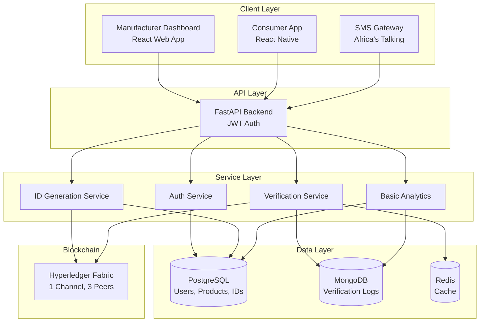

# DrugChain MVP Specification

## 1. Executive Summary

This document defines the **Minimum Viable Product (MVP)** for DrugChain - a blockchain-anchored drug verification platform designed to combat counterfeit medicines in Nigeria. The MVP will validate core assumptions and demonstrate value to stakeholders (manufacturers, regulators, consumers) within a 12-week development timeline and $250,000 seed budget.

### MVP Goals
1. **Prove Core Functionality**: Three-level ID generation and one-time verification lock
2. **Demonstrate Blockchain Value**: Immutable provenance tracking
3. **Validate User Adoption**: Consumer willingness to verify products
4. **Attract Pilot Partners**: Onboard 1-2 manufacturers and NAFDAC
5. **Generate Metrics**: Verification rates, counterfeit detection data

---

## 2. MVP Scope Definition

### 2.1 In-Scope Features (MVP Phase 1)

#### **Core Features**
✅ **Three-Level ID Generation System**
- Batch ID generation
- Carton ID generation
- Pack ID generation (cryptographically secure + checksum)
- Bulk ID generation (up to 100,000 IDs per batch)
- QR code generation for pack IDs

✅ **Blockchain Integration**
- Hyperledger Fabric network setup (single channel, 3 organizations)
- Chaincode for pack registration and verification
- One-time verification lock (ACTIVE → USED status)
- Immutable verification logging

✅ **Consumer Verification**
- Mobile app (Android priority, iOS later)
- QR code scanner
- Verification result display (GENUINE/COUNTERFEIT/INVALID)
- Offline-capable (local cache for recent scans)
- SMS verification (via Africa's Talking)

✅ **Manufacturer Dashboard**
- User registration and authentication (JWT)
- Product catalog management
- Batch creation and ID generation interface
- QR code download (ZIP file of images + CSV)
- Basic analytics dashboard:
  - Total batches created
  - Total verifications
  - Verification rate
  - Geographic distribution (state-level)

✅ **Regulator Portal (Basic)**
- NAFDAC login with elevated permissions
- View all batches nationwide
- View verification logs
- Basic counterfeit alert notifications

✅ **API Infrastructure**
- RESTful API (FastAPI)
- JWT authentication
- Basic rate limiting
- PostgreSQL + MongoDB + Redis setup

#### **Key User Stories**

**As a Manufacturer**:
- I can register my company and products
- I can create a production batch and generate unique IDs
- I can download QR codes for printing on packaging
- I can see how many of my products have been verified

**As a Consumer**:
- I can scan a QR code on medicine packaging
- I can see immediately if the product is genuine or fake
- I can report suspected counterfeits
- I can verify via SMS if I don't have a smartphone

**As a Regulator (NAFDAC)**:
- I can view all registered manufacturers and products
- I can see nationwide verification statistics
- I can receive alerts when counterfeit products are detected
- I can access complete audit trails on blockchain

---

### 2.2 Out-of-Scope for MVP (Future Phases)

❌ **Not in MVP**:
- Full supply chain transfer tracking (manufacturer → distributor → pharmacy)
- Distributor and pharmacy portals
- Advanced analytics (demand forecasting, ML anomaly detection)
- Offline regulator devices with evidence capture
- USSD support (SMS only for MVP)
- Multi-language support (English only)
- iOS mobile app (Android first)
- Webhook integrations
- ERP system integrations
- Push notifications
- Recall management system
- Expiry date monitoring

---

## 3. MVP Technical Stack

### 3.1 Backend

| Component | Technology | Reasoning |
|-----------|-----------|-----------|
| **API Framework** | FastAPI (Python 3.11+) | High performance, auto-docs, async support |
| **Database (Relational)** | PostgreSQL 15 | Robust, ACID compliance, JSON support |
| **Database (Document)** | MongoDB 6.0 | Flexible schema for logs, easy scaling |
| **Cache** | Redis 7.0 | Fast verification caching, session management |
| **Blockchain** | Hyperledger Fabric 2.5 | Permissioned, enterprise-grade, privacy |
| **Authentication** | JWT + bcrypt | Stateless, secure password hashing |
| **Task Queue** | Celery + Redis | Async ID generation, batch processing |
| **SMS Gateway** | Africa's Talking | Nigeria-focused, reliable, affordable |

### 3.2 Frontend

| Component | Technology | Reasoning |
|-----------|-----------|-----------|
| **Web Dashboard** | React 18 + TypeScript | Component-based, large ecosystem |
| **UI Framework** | Tailwind CSS | Rapid prototyping, consistent design |
| **State Management** | Redux Toolkit | Predictable state, dev tools |
| **Charts** | Chart.js + Recharts | Simple, interactive analytics |
| **Mobile App** | React Native 0.72+ | Code reuse, cross-platform (future iOS) |
| **QR Scanner** | react-native-vision-camera | Performant, modern API |
| **HTTP Client** | Axios | Interceptors, request cancellation |

### 3.3 Infrastructure

| Component | Technology | Reasoning |
|-----------|-----------|-----------|
| **Cloud Provider** | AWS (initially) | Mature, Nigeria region (future) |
| **Container** | Docker | Consistent environments |
| **Orchestration** | Docker Compose (MVP) | Simple, local/single-server deployment |
| **Web Server** | NGINX | Reverse proxy, static files, SSL |
| **CI/CD** | GitHub Actions | Free, integrated with repo |
| **Monitoring** | Basic logging + AWS CloudWatch | Cost-effective for MVP |

---

## 4. MVP Architecture Diagram



---

## 5. Development Timeline (12 Weeks)

### **Week 1-2: Foundation & Setup**
- **Backend**:
  - Set up FastAPI project structure
  - Database schema implementation (PostgreSQL)
  - User authentication (registration, login, JWT)
  - Basic CRUD for organizations and products
- **Blockchain**:
  - Hyperledger Fabric network setup (Docker Compose)
  - Chaincode development (RegisterPack, VerifyPack functions)
- **Frontend**:
  - React project setup with Tailwind CSS
  - Login/registration UI
  - Basic dashboard layout
- **Deliverable**: Working authentication system

---

### **Week 3-4: ID Generation System**
- **Backend**:
  - ID generation algorithms (batch, carton, pack)
  - QR code generation (qrcode library)
  - Bulk ID generation with Celery
  - Blockchain integration for pack registration
- **Frontend**:
  - Product catalog UI
  - Batch creation form
  - ID generation interface
  - QR code download functionality
- **Testing**:
  - Generate 10,000 IDs and verify uniqueness
  - Test blockchain anchoring
- **Deliverable**: Manufacturer can create batch and download QR codes

---

### **Week 5-6: Verification System**
- **Backend**:
  - Verification API endpoint
  - Blockchain query integration
  - Status update logic (ACTIVE → USED)
  - MongoDB verification logging
  - Redis caching layer
  - SMS gateway integration (Africa's Talking)
- **Mobile App**:
  - React Native project setup
  - QR code scanner integration
  - Verification result screen
  - Basic offline support
- **Testing**:
  - Test verification flow end-to-end
  - Test one-time lock mechanism
  - Test SMS verification
- **Deliverable**: Working consumer verification via mobile and SMS

---

### **Week 7-8: Analytics & Dashboards**
- **Backend**:
  - Analytics endpoints (verification stats, geographic distribution)
  - MongoDB aggregation pipelines
- **Frontend**:
  - Manufacturer analytics dashboard
  - Charts and visualizations
  - Batch details page
  - Verification history viewer
- **Regulator Portal**:
  - NAFDAC login
  - Nationwide statistics view
  - Verification logs viewer
- **Deliverable**: Real-time analytics for manufacturers and regulators

---

### **Week 9-10: Testing & Bug Fixes**
- **Comprehensive Testing**:
  - Unit tests for critical functions
  - Integration tests for API endpoints
  - End-to-end tests (manufacturer → consumer flow)
  - Load testing (simulate 1000 concurrent verifications)
  - Security testing (OWASP Top 10)
- **Bug Fixes**:
  - Address identified issues
  - Performance optimization
  - UI/UX improvements
- **Deliverable**: Stable, tested MVP

---

### **Week 11: Pilot Deployment**
- **Infrastructure**:
  - AWS EC2 setup
  - PostgreSQL RDS deployment
  - MongoDB Atlas setup
  - Redis ElastiCache
  - NGINX configuration with SSL (Let's Encrypt)
  - Domain setup (api.drugchain.ng, app.drugchain.ng)
- **Deployment**:
  - Docker containers deployment
  - Hyperledger Fabric network on EC2
  - Mobile app beta release (Google Play internal testing)
- **Deliverable**: Production-ready deployment

---

### **Week 12: Pilot Launch & Onboarding**
- **Manufacturer Onboarding**:
  - Onboard 1-2 pilot manufacturers
  - Training sessions on platform usage
  - Support for first batch creation
- **NAFDAC Engagement**:
  - Present system to NAFDAC
  - Create regulator accounts
  - Demonstrate nationwide visibility
- **Consumer Awareness**:
  - QR code stickers on pilot products
  - Basic user guide/video
  - App download campaign
- **Deliverable**: Live pilot with real products in market

---

## 6. MVP Success Metrics

### 6.1 Technical Metrics
- [ ] **System Uptime**: > 99% during pilot
- [ ] **Verification Response Time**: < 2 seconds (95th percentile)
- [ ] **ID Generation**: Successfully generate 100,000+ pack IDs
- [ ] **Blockchain Transactions**: 10,000+ packs registered on-chain
- [ ] **Mobile App Performance**: App load time < 3 seconds

### 6.2 Business Metrics
- [ ] **Manufacturer Adoption**: 2+ manufacturers onboarded
- [ ] **Products Registered**: 10+ products in catalog
- [ ] **Batches Created**: 20+ batches with IDs generated
- [ ] **Consumer Verifications**: 1,000+ verifications via app/SMS
- [ ] **Verification Rate**: > 10% of produced packs verified within 3 months
- [ ] **Counterfeit Detection**: Demonstrate detection of at least 1 fake product
- [ ] **Regulator Engagement**: NAFDAC actively using platform

### 6.3 User Experience Metrics
- [ ] **App Downloads**: 500+ Android app installations
- [ ] **User Satisfaction**: > 80% positive feedback
- [ ] **Verification Success**: > 95% successful scans (no errors)
- [ ] **SMS Adoption**: > 20% verifications via SMS (feature phone users)

---

## 7. Testing Strategy

### 7.1 Automated Tests

**Backend (FastAPI)**:
```python
# Unit tests (pytest)
def test_generate_pack_id():
    pack_id = generate_pack_id("BATCH-001", "CARTON-001", 1)
    assert len(pack_id) == 16
    assert pack_id.isalnum()

def test_verification_genuine():
    # Mock blockchain response
    result = verify_pack("AX7K9M2P5N8Q3R1T")
    assert result["verification_result"] == "GENUINE"
    assert result["data"]["status"] == "USED"

# Integration tests
async def test_batch_creation_flow():
    response = await client.post("/ids/batch", json=batch_data, headers=auth_headers)
    assert response.status_code == 201
    batch_id = response.json()["data"]["batch_id"]
    
    # Verify blockchain registration
    blockchain_data = await query_blockchain(batch_id)
    assert blockchain_data is not None
```

**Frontend (Jest + React Testing Library)**:
```javascript
test('displays verification result correctly', async () => {
  render(<VerificationResult packId="AX7K..." />);
  
  await waitFor(() => {
    expect(screen.getByText(/GENUINE/i)).toBeInTheDocument();
    expect(screen.getByText(/Amoxicillin/i)).toBeInTheDocument();
  });
});
```

### 7.2 Manual Testing Checklist

**Manufacturer Flow**:
- [ ] Register manufacturer account
- [ ] Add product to catalog
- [ ] Create production batch
- [ ] Generate 1000 pack IDs
- [ ] Download QR codes ZIP
- [ ] Verify QR codes scannable

**Consumer Flow**:
- [ ] Download mobile app
- [ ] Scan genuine product QR code → Should show GENUINE
- [ ] Scan same QR code again → Should show COUNTERFEIT
- [ ] Scan invalid QR code → Should show INVALID
- [ ] Verify via SMS with valid pack ID
- [ ] Test offline mode (airplane mode)

**Regulator Flow**:
- [ ] Login with NAFDAC credentials
- [ ] View nationwide statistics
- [ ] View verification logs
- [ ] Receive counterfeit alert notification

### 7.3 Load Testing

**Artillery.io Configuration**:
```yaml
config:
  target: 'https://api.drugchain.ng'
  phases:
    - duration: 60
      arrivalRate: 10  # 10 requests/second
      name: "Warm up"
    - duration: 120
      arrivalRate: 50  # 50 requests/second
      name: "Peak load"

scenarios:
  - name: "Verification Load Test"
    flow:
      - post:
          url: "/api/v1/verify"
          json:
            pack_id: "{{ $randomString() }}"
```

---

## 8. Deployment Plan

### 8.1 Infrastructure Setup (AWS)

**Resources**:
- **EC2 Instances**:
  - t3.medium (API server) - $35/month
  - t3.large (Hyperledger Fabric nodes) x 3 - $100/month
- **RDS PostgreSQL** (db.t3.micro) - $15/month
- **MongoDB Atlas** (M10 shared cluster) - $60/month
- **ElastiCache Redis** (cache.t3.micro) - $13/month
- **S3 Storage** (QR codes, documents) - $10/month
- **CloudFront CDN** - $20/month
- **Route 53 DNS** - $1/month

**Total Monthly Cost (MVP)**: ~$254/month

### 8.2 Deployment Steps

1. **Infrastructure Provisioning** (Terraform):
```hcl
# main.tf
resource "aws_instance" "api_server" {
  ami           = "ami-0c55b159cbfafe1f0"  # Ubuntu 22.04
  instance_type = "t3.medium"
  
  tags = {
    Name = "drugchain-api"
  }
}

resource "aws_db_instance" "postgres" {
  allocated_storage    = 20
  engine               = "postgres"
  engine_version       = "15.3"
  instance_class       = "db.t3.micro"
  db_name              = "drugchain"
  username             = var.db_username
  password             = var.db_password
}
```

2. **Docker Deployment**:
```bash
# Deploy with Docker Compose
docker-compose -f docker-compose.prod.yml up -d
```

3. **Blockchain Network**:
```bash
# Start Hyperledger Fabric network
./network.sh up createChannel -c drugchain-channel
./network.sh deployCC -ccn drugchain -ccp ./chaincode
```

4. **SSL Certificate** (Let's Encrypt):
```bash
certbot --nginx -d api.drugchain.ng -d app.drugchain.ng
```

### 8.3 CI/CD Pipeline (GitHub Actions)

```yaml
# .github/workflows/deploy.yml
name: Deploy to Production

on:
  push:
    branches: [main]

jobs:
  test:
    runs-on: ubuntu-latest
    steps:
      - uses: actions/checkout@v3
      - name: Run tests
        run: |
          pip install -r requirements.txt
          pytest tests/
  
  deploy:
    needs: test
    runs-on: ubuntu-latest
    steps:
      - name: Deploy to AWS
        run: |
          ssh ubuntu@api.drugchain.ng "cd /app && git pull && docker-compose up -d --build"
```

---

## 9. MVP Budget Breakdown ($250,000)

### 9.1 Development Costs (60% - $150,000)

| Role | Rate | Duration | Cost |
|------|------|----------|------|
| **Senior Backend Engineer** | $80/hr | 480 hrs (12 weeks) | $38,400 |
| **Senior Frontend Engineer** | $75/hr | 480 hrs | $36,000 |
| **Blockchain Developer** | $100/hr | 320 hrs (8 weeks) | $32,000 |
| **Mobile Developer (React Native)** | $70/hr | 320 hrs | $22,400 |
| **DevOps Engineer** | $85/hr | 160 hrs (4 weeks) | $13,600 |
| **QA Engineer** | $50/hr | 240 hrs (6 weeks) | $12,000 |
| **UI/UX Designer** | $60/hr | 80 hrs (2 weeks) | $4,800 |
| **Project Manager** | $70/hr | 240 hrs (part-time) | $16,800 |
| **Total Development** | | | **$176,000** |

### 9.2 Infrastructure Costs (10% - $25,000)

| Item | Cost |
|------|------|
| **Cloud Hosting (AWS)** - 6 months | $1,500 |
| **MongoDB Atlas** - 6 months | $360 |
| **Africa's Talking Credits** | $500 |
| **Domain Registration** | $50 |
| **SSL Certificates (initial)** | $0 (Let's Encrypt) |
| **Development Tools (GitHub, monitoring)** | $600 |
| **Contingency** | $3,000 |
| **Total Infrastructure** | **$6,010** |

### 9.3 Pilot & Marketing (15% - $37,500)

| Item | Cost |
|------|------|
| **Manufacturer Onboarding (travel, training)** | $10,000 |
| **NAFDAC Engagement & Compliance** | $15,000 |
| **Consumer Awareness Campaign** | $8,000 |
| **QR Code Printing (pilot batches)** | $2,000 |
| **User Training Materials (videos, docs)** | $2,500 |
| **Total Pilot & Marketing** | **$37,500** |

### 9.4 Legal & Compliance (5% - $12,500)

| Item | Cost |
|------|------|
| **Data Privacy Compliance (NDPR)** | $5,000 |
| **Intellectual Property (trademark, patents)** | $5,000 |
| **Legal Consultation** | $2,500 |
| **Total Legal** | **$12,500** |

### 9.5 Contingency (10% - $25,000)

**Total MVP Budget**: $176,000 + $6,010 + $37,500 + $12,500 + $25,000 = **$257,010**  
*(Slightly over due to development costs; can optimize by reducing hours)*

---

## 10. Risk Analysis & Mitigation

| Risk | Probability | Impact | Mitigation |
|------|------------|--------|-----------|
| **Manufacturer reluctance to adopt** | Medium | High | Start with 1 pilot manufacturer, prove ROI |
| **Low consumer verification rate** | Medium | High | Incentivize (e.g., scratch-and-win on QR codes) |
| **Blockchain performance issues** | Low | Medium | Use caching, optimize chaincode |
| **SMS gateway downtime** | Low | Medium | Fallback to alternate provider (Twilio) |
| **Budget overrun** | Medium | Medium | Strict milestone tracking, agile approach |
| **NAFDAC regulatory delays** | High | High | Early engagement, align with existing regulations |
| **Technical talent shortage** | Low | High | Hire remotely, offer competitive rates |
| **Counterfeiters cloning QR codes** | Medium | High | Use cryptographic checksums, educate consumers |

---

## 11. Go-Live Checklist

### Pre-Launch
- [ ] All automated tests passing
- [ ] Load testing completed (1000 concurrent users)
- [ ] Security audit completed (OWASP Top 10)
- [ ] SSL certificates installed
- [ ] Database backups configured
- [ ] Monitoring and alerting setup
- [ ] Mobile app submitted to Google Play (internal testing)
- [ ] Manufacturer onboarding completed
- [ ] NAFDAC demo and approval

### Launch Day
- [ ] Deploy to production
- [ ] Verify all services running
- [ ] Test verification flow end-to-end
- [ ] Monitor logs for errors
- [ ] Announce to pilot manufacturers
- [ ] Press release (if applicable)

### Post-Launch (Week 1)
- [ ] Daily monitoring of verification rates
- [ ] User support channels active
- [ ] Bug triage and hotfixes
- [ ] Collect user feedback
- [ ] Weekly metrics report to stakeholders

---

## 12. Post-MVP Roadmap (Phase 2-4)

### **Phase 2 (Months 4-6): Supply Chain Tracking**
- Transfer logging (manufacturer → distributor → pharmacy)
- Distributor and pharmacy portals
- Enhanced audit trails

### **Phase 3 (Months 7-9): Advanced Features**
- iOS mobile app
- Offline regulator devices
- Advanced anomaly detection (ML)
- Multi-language support (Hausa, Yoruba, Igbo)
- USSD support for feature phones

### **Phase 4 (Months 10-12): Scale & Expand**
- National rollout across Nigeria
- Onboard 50+ manufacturers
- Regional expansion (Ghana, Kenya)
- ERP integrations
- Demand forecasting

---

## Summary

This MVP specification provides:
- ✅ **Clear scope**: Core verification features only
- ✅ **Realistic timeline**: 12 weeks with buffer
- ✅ **Validated technical stack**: Proven technologies
- ✅ **Measurable success criteria**: Technical + business metrics
- ✅ **Risk mitigation**: Identified risks with solutions
- ✅ **Budget alignment**: $250K seed funding
- ✅ **Pilot-ready**: Designed for real-world testing in Nigeria

**Next Step**: Development team assembly and Week 1 kickoff.
